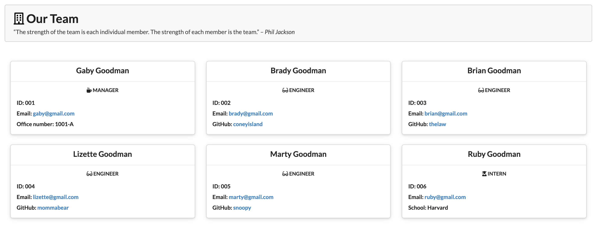

[](https://github.com/keycole)&nbsp;&nbsp;&nbsp;[](mailto:nicole.graiff@gmail.com)


# Employee Summary Template Engine

## Description
A Node CLI that takes in information about employees and generates an HTML webpage that displays summaries for each person.

#### Table of Contents

[Demo](#demo) &nbsp;&nbsp;&nbsp;| &nbsp;&nbsp;&nbsp; [Installation](#installation) &nbsp;&nbsp;&nbsp; | &nbsp;&nbsp;&nbsp; [Tests](#tests) &nbsp;&nbsp;&nbsp; | &nbsp;&nbsp;&nbsp; [Contributing](#contributing) &nbsp;&nbsp;&nbsp; | &nbsp;&nbsp;&nbsp; [License](#license)

## Demo
**Link to screencast:** https://drive.google.com/file/d/10xKknzbApAdz-KZ5FXeDnxwXR6yhJgf3/view


**Desktop Output**



**Tablet Output**


**Mobile Output**


## Installation
- Clone the repository
- Navigate to the folder containing app.js in the terminal and enter ```npm install```
- To start the program, enter ```node app.js``` into the command line.
- Follow the prompts to enter information for your team members.
- When done, a team.html file will be generated in the output directory. See the Demo section above for examples of the finished product.


## Tests
- To run tests, enter ```npm run test``` in the command line.

## Contributing
- Fork or clone the repository
- Extend and improve the code, make it your own, making it amazing!
- Reach out to me with your work and share your code! 

## License

[](https://opensource.org/licenses/MIT)